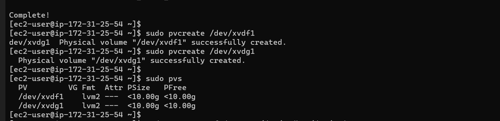
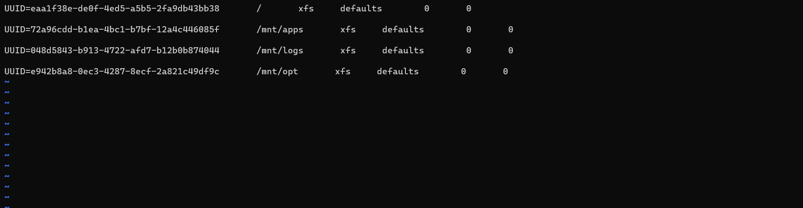
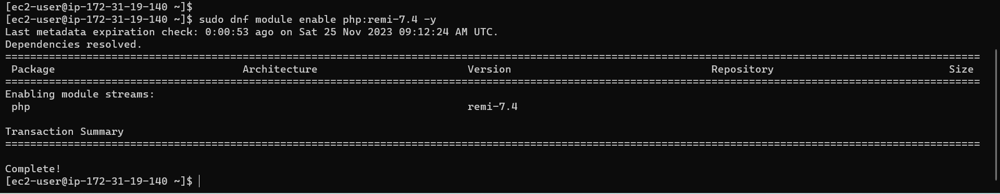

# Devops Tooling Website Solution 


In previous project, we implemented a Wordpress based solution that is ready to be filled with content and can be used as a full-fledged website or blog. In this project, we will move further to add some more value to our solutions that a Devops team could utilize in day to day activities in managing, developing, testing, deploying and monitoring different projects. 

In this project, we will implement a solution that consist of the following components;

Infrastructure: AWS

Webserver Linux: Red Hat Enterprise Linux 8

Database Server: Ubuntu 20.04 + MySQL

Storage Server: Red Hat Enterprise Linux 8 + NFS Server

Programming Language: PHP

Code Repository: GitHub

For Rhel 8 server, we use this ami `RHEL-8.6.0_HVM-20220503-x86_64-2-Hourly2-GP2 (ami-035c5dc086849b5de)`


## Step 1: Preparing our NFS Server

First, we launched an EC2 instance (Red Hat Linux OS 8) and on the EBS console, we created two volumes each of 10GB and then create 3 logical volumes on it. 


Attached all volumes to our NFS server


SSH into our terminal to begin configurations and with `lsblk` command we inspect what block devices are attached to the server


Then `gdisk` utility to create a single partition on each of the disks and also inspect it by running 

```sudo gdisk /dev/xvdf
sudo gdisk /dev/xvdf
sudo lsblk
```


Next we install LVM package on our NFS Server with `sudo yum install lvm2`


Next step is to use the `pvcreate` utility to initialize each of the disk as physical volumes and then inspect with `sudo pvs`



Then we add all pvs to a volume group with vgcreate utility 

`sudo vgcreate nfs
data-vg /dev/xvdg1 /dev/xvdf1 `


Now we can use `lvcreate` utility to create 3 logical volumes by sharing the vgs to 3 lvs (lv-opt, lv-apps, lv-logs) and allocating 6gb to each of the lvs


Checking the Lvs with `sudo lvs`


Now we need to format all logical volumes using `xfs` instead of `ext4`.


Then we create mount points on `/mnt` directory for the lvs and then we mount our logical volumes to the allocated directories as follows: 

`lv-apps` on `/mnt/apps` for webservers 
`lv-logs` on `/mnt/logs` for webserver logs 
`lv-opt` on `/mnt/opt` to be used by jenkins in coming project. 


To enable the mounting persist after a reboot, we configured the `/etc/fstab` directory



Now we install NFS server, configure it to start on reboot and ensure that it is running. 

```

sudo yum -y update
sudo yum install nfs-utils -y
sudo systemctl start nfs-server.service
sudo systemctl enable nfs-server.service
sudo systemctl status nfs-server.service

```


Now that NFS is running, we will install our 3 webservers inside the same subnet, but for higher level of security it is advisable we seperate each tier inside its own subnet. 

Next we open our EC2 console and locate Networking tab and open a subnet link inside the NFS server and copy the `subnet cidr` which will be used to link our NFS to our 3 web servers.


Then we set up permission that will allow our web servers to read, write and execute files on NFS, then we restart NFS.

```
sudo chown -R nobody: /mnt/apps
sudo chown -R nobody: /mnt/logs
sudo chown -R nobody: /mnt/opt

sudo chmod -R 777 /mnt/apps
sudo chmod -R 777 /mnt/logs
sudo chmod -R 777 /mnt/opt

sudo systemctl restart nfs-server.service

```


Next we configure access to NFS for client within the same subnet 

`sudo vi /etc/exports`

```

/mnt/apps <Subnet-CIDR>(rw,sync,no_all_squash,no_root_squash)

/mnt/logs <Subnet-CIDR>(rw,sync,no_all_squash,no_root_squash)

/mnt/opt <Subnet-CIDR>(rw,sync,no_all_squash,no_root_squash)

```

`sudo exportfs -arv`


Now we check which port is used by NFS and then open it using security groups. We also have to set inbound rule for TCP 111, UDP 111 and UDP 2049 linked to our subnet cidr which allows other servers to access NFS. 

`rpcinfo -p | grep nfs`


## Step2: Configuring Database Server

We spin up an EC2 instance for our DB server, but this time we use `ubuntu 20.04`, we set inbound rule for mysql and then we SSH into our db server, update the system and install `mysql-server` 

```
sudo apt update -y
sudo apt install mysql-server -y
```


Next we open mysql with `sudo mysql` create a user `webaccess`, create database `tooling` and then grant user `webaccess` full access to our database `tooling`. 


Finally in this step we configure mysql binding address and restart mysql


## Step3: Preparing the Webservers

In this step, we will create 2 RHEL 8 for our webservers, and then make sure they can serve the same content from our NFS server and MySQL database server. Further in this steps, some configurations will be done on this web servers as follows; 

+ To configure NFS client

+ To deploy tooling website application

+ To configure servers to work with database


Now we install NFS client on our webserver 


Then we create and mount `/var/www` to our NFS server's export for apps


To enable our mount configuration persist after a reboot, we need to open the `/etc/fstab` and paste the following 

```
sudo vi /etc/fstab

<NFS-Server-Private-IP-Address>:/mnt/apps /var/www nfs defaults 0 0

```


Next step is to install Remi's repository, Apache and PHP, we then start and enable them after successful installation. 

`sudo yum install httpd -y
`


`sudo dnf install https://dl.fedoraproject.org/pub/epel/epel-release-latest-8.noarch.rpm`


`sudo dnf install dnf-utils http://rpms.remirepo.net/enterprise/remi-release-8.rpm`


`sudo dnf module reset php`


sudo dnf module enable php:remi-7.4



sudo dnf install php php-opcache php-gd php-curl php-mysqlnd


`sudo systemctl start php-fpm`

`sudo systemctl enable php-fpm`

`sudo setsebool -P httpd_execmem 1`


To verify that our webserver and NFS server share same content, we check the `/var/www` on our webserver and `/mnt/apps` on our NFS server, we should see our Apache files as shown below. Alternatively, we created a file `test.txt` in the NFS server `/mnt/apps` directory and as expected we found the file in the webserver `/var/www` directory as shown below;


We also implemented the above steps for other 2 webservers and they were able to share same content with our NFS server 


Next step is to locate the log folder for Apache and mount it to NFS server's export for logs


Then configure `/etc/fstab` to enable the mount persist after reboot.


Now we fork the Devops tooling repository to our web server and then copy the content in the `html` folder to our `/var/www/html`


then we check permission to our /var/www/html folder and also disable SELinuz with `sudo senforce 0` and to make this changes permanent, we open the config file `sudo vi /etc/sysconfig/selinux` and set selinux to disable and then we restart Apache. 


Now we can update the website configuration to connect to the database in `var/www/html/function.php`


then we inject the tooling-db.sql script to our database with `mysql -h <db provate ip> -u <db-username> -p <db-passwd> < tooling-db.sql`


Finally, we can access our website on the browser with the webserver public IP which then shows the tooling index page as shown below. 


