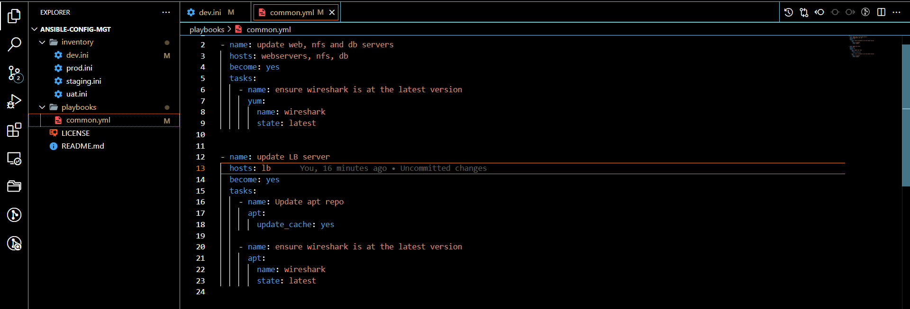
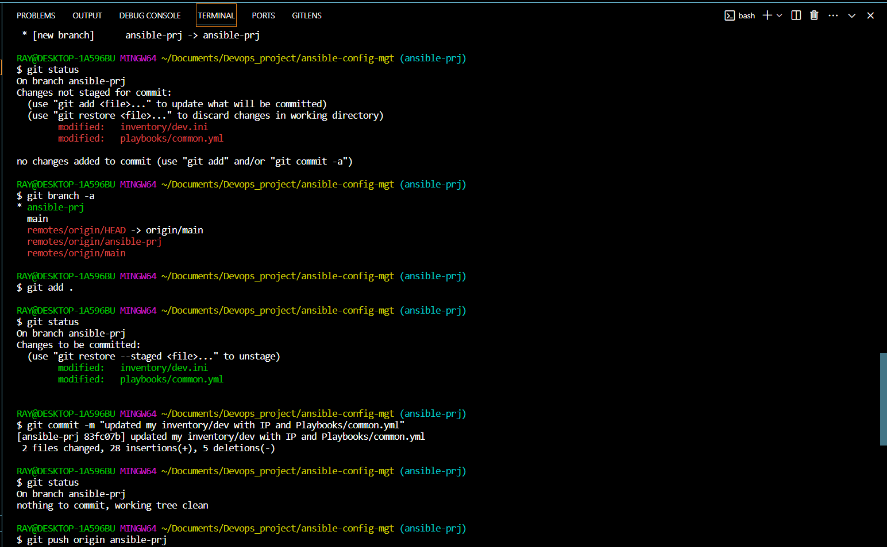

# Ansible Automate Project 

In this project, we have two task in which one is to 
+ Install and configure `Ansible-client` to act as a `jump-server/Bastion-host` and the other is to 

+ Create a simple Ansible-playbook to automate servers configuration


## Step1:  Install and configure ansible on ec2 instance 

First, we created an ec2 instance "ubuntu" and named it "jenkins-Ansible" , this server will serve as jump server and will be used to run playbooks. 

Ensure Jenkins is up and running by running 

`sudo systemctl status jenkins`


Then we visit jenkins-ansible on our web browser to ensure jenkins is ready. 


Next step is to update server and install ansible. 


Then create a new repository on github `Ansible-config-mgt` and configure jenkins to arc
hive our repository content everytime a change is made. To do that;

+ We created a new freestyle project `Ansible` and point it to our `ansible-config-mgt`

+ Configured a webhook in GitHub and then set the webhook to trigger ansible build. 

And everytime we stop/start our jenkins-ansible server, we need to reconfigure GitHub webhook to a new IP address, to avoid this we can simply allocate an elastic IP. 


## Step2: Preparing our development environment using visual studio code

This step includes installing visual studio code on our local computer and cloning our `ansible-config-mgt` repository to Jenkins-Ansible instance. 


## Step 3: Ansible development

In this step, we created and checkout to a new branch that will be used for development named  `ansible-prj`. 

Inside this branch, we created a directory for `Playbooks` and `Inventory`. 

Within the playbooks directory, we created a file `common.yml` and as for the inventory directory, we created a file for different environment as follows `dev.ini, staging.ini, uat.ini and prod.ini`


## Step 4: Setup ansible inventory

Ansible inventory file usually consist of hosts d groups of hosts upon which commands, modules and task in a playbook operates. 

Ansible uses TCP port 22 by default to SSH into our target servers from our bastion host `Jenkins-Ansible`, and with the help of our SSH Agent, we are able to communicate with other servers. 

Now we import our Jenkins-ansible keypair `rhel8ec2.pem` into our ssh-agent

```
ssh-add <path-to-private-key>

ssh-add -l 
```


Then we configured visual studio code to be able to ssh into jenkins-ansible with ssh-agent. 

`ssh -A ubuntu@public-ip
`


Now we add the below code into our inventory/dev.ini and update them with each servers private IP address. 

```
[nfs]
<NFS-Server-Private-IP-Address> ansible_ssh_user=ec2-user

[webservers]
<Web-Server1-Private-IP-Address> ansible_ssh_user=ec2-user
<Web-Server2-Private-IP-Address> ansible_ssh_user=ec2-user

[db]
<Database-Private-IP-Address> ansible_ssh_user=ec2-user 

[lb]
<Load-Balancer-Private-IP-Address> ansible_ssh_user=ubuntu

```


## Step 5: Create a common playbook

In this step, we will give ansible some simple instructions on what to be performed on all servers listed in `inventory/dev.ini` by updating our `playbook/common.yml` file with the following code;

```
---
- name: update web, nfs and db servers
  hosts: webservers, nfs, db
  become: yes
  tasks:
    - name: ensure wireshark is at the latest version
      yum:
        name: wireshark
        state: latest
   

- name: update LB server
  hosts: lb
  become: yes
  tasks:
    - name: Update apt repo
      apt: 
        update_cache: yes

    - name: ensure wireshark is at the latest version
      apt:
        name: wireshark
        state: latest

```



The above playbook is divided into two part, both part is intended to perform same task; to install `wireshark` utility or make sure it's updated to latest version on our RHEL 8 and Ubuntu servers.

## Step 6: Updating git with the latest code

In this step, we commit and push our codes from `ansible-prj` to github

```
git status

git add <selected files>

git commit -m "commit message"

```




Now we navigate to Github to create a pull request, review changes and merge codes to `main` branch and then pull the codes from back to main branch on our local machine. 


After merging the codes from `ansible-prj` to `main` jenkins automatically saved all files (build artifact) to `/var/lib/jenkins/jobs/ansible` directory on `jenkins-ansible` server. 


## Step 7: Start running Ansible playbook

To run a successful ansible playbook, we first need to `CD` into `ansible-config-mgt` directory and then run our playbook

`ansible-playbook -i inventory/dev.ini playbooks/common.yml
`


As expected, ansible did installed wireshark on all servers. 


We also updated the playbooks/common.yml to create a testdirectory, a file inside it and also change the timezones on all servers.


Finally, our setup looks like the diagram below;

