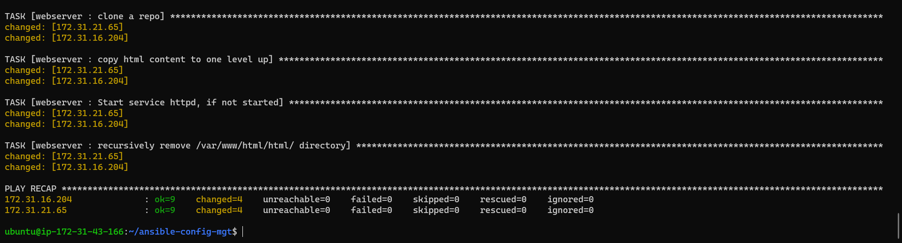
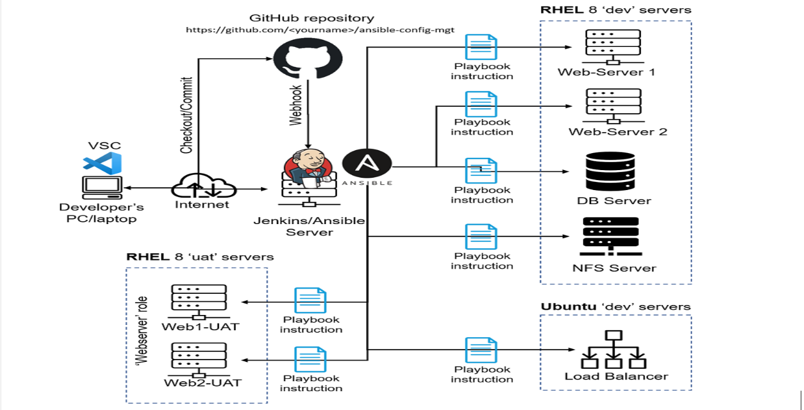

# Ansible Refactoring, Assignments and Imports Project. 

In this project, we will continue working with `ansible-config-mgt` repository and make some improvement to the codes. we need to refactor our ansible code, create assignments and learn how to use the imports functionality. 

Ansible Imports module allow us to effectively re-use previously created playbooks in a new playbook. 

Code Refactoring is a general term in computer programming. It simply means making changes to the source code without changing expected behaviour of the software. The main idea of refactoring is to enhance code readability, increase maintainability and extensibility, reduce complexity, add proper comments without affecting the logic.

Now we will proceed to see how we can improve our ansibe codes. 

## Step 1: Jenkins job enhancement

Every new change in the codes creates a separate directory which is not convinient when we want to run some commands from one place and it also consumes space on our `jenkins-ansible` server with each subsequent change. Now we enhance it by introducing a new jenkins project which will require `copy artifact plugin`

- On `jenkins-ansible` server, we created a new directory called `ansible-config-mgt` it will be used to store all artifacts after each build.

`sudo mkdir /home/ubuntu/ansible-config-artifact
`

- Then we change permissions to this directory so jenkins can save files there 

`sudo chmod -R 0777 /home/ubuntu/ansible-config-artifact


- On Jenkins web console, we install `copy artifact` plugin without restarting jenkins. 


- Create and configure new freestyle project `save_artifacts`, this project will be triggered by previously created `ansible` project. 

The main idea of `save_artifacts` project is to save artifacts into `/home/ubuntu/ansible-config-artifact` directory. To achieve this, we create a build step and choose copy artifacts from other project, soecify `ansible` as a source project and `/home/ubuntu/ansible-config-artifact` as a target directory. 


- Now we test our set up by making changes in README.MD file inside `ansible-config-mgt` repository inside main branch. 

If both Jenkins jobs have completed one after another,, we shall see our files inside `/home/ubuntu/ansible-config-artifact` directory and it will be updated with every commit to main branch. 


## Step 2: Refactor ansible codes by importing other playbooks to `site.yml`

Before we start to refactor our codes, we pull down the latest code from main branch and then create a new branch `refactor`


In project 11, we wrote all task in a single playbook `common.yml`, these intructions is for only 2 types of operating system, but lets imagine we have more tasks and we need to apply this playbook to other servers with different requirements. In this case, we will have to read through the whole playbook to check if all tasks written there are applicable and is there anything that we need to add for certain server/OS families. 

This approach becomes more tedious and our playbook will become very messy with many commented parts. However, breaking tasks up into different files is an excellent way to organize complex set of tasks and reuse them. 

- First we created `site.yml` file inside `playbooks` folder. This file will become a parent to all other playbooks that will be developed including `common.yml` which means other playbooks will be referenced in the `site.yml` file. 

- Then we create a new folder `static-assignments` in the root of the repository which will be where all other children playbooks will be stored. 

- And then we move `common.yml` file inside `static-assignment` folder.

- Inside `site.yml` file, we use ansible import module to import `common.yml` playbook.

```
---
- hosts: all
- import_playbook: ../static-assignments/common.yml
```

- Now we run `ansible-playbook` command against the dev environment

As wireshark is already installed on our dev servers, we then created another playbook `common-del.yml` under `static-assignments` and then configure this playbook to delete `wireshark` utility from our dev servers. 

```
---
- name: update web, nfs and db servers
  hosts: webservers, nfs, db
  remote_user: ec2-user
  become: yes
  become_user: root
  tasks:
  - name: delete wireshark
    yum:
      name: wireshark
      state: removed

- name: update LB server
  hosts: lb
  remote_user: ubuntu
  become: yes
  become_user: root
  tasks:
  - name: delete wireshark
    apt:
      name: wireshark-qt
      state: absent
      autoremove: yes
      purge: yes
      autoclean: yes

```


- Now we update `site.yml` import module and modify our playbook to the newly created `common-del.yml` then we run it against dev servers. 


- verify that wireshark is deleted on all servers by running `wireshark --version`


## Step 3: Configuring UAT webservers with a role webserver

In this step, we configured 2 new web servers as `uat`. we could write task to configure web servers in the same playbook, but it would be too messy. Instead, we will use a dedicated role to make our configuration reusable. 

- Now we launched 2 new ec2 instance using RHEL 8 image and then named them `web1-UAT` and `web2-UAT`.


- To create a role we must create a directory `roles/` or in `/etc/ansible/` directory. 

And we can create this folder structure by using ansible utility called `ansible-galaxy` inside `ansible-config-mgt/roles` directory or by manual creation. In this case, we use created the files and folder manually as shown below;


```
└── webserver
    ├── README.md
    ├── defaults
    │   └── main.yml
    ├── handlers
    │   └── main.yml
    ├── meta
    │   └── main.yml
    ├── tasks
    │   └── main.yml
    └── templates


```


- Next step is to update `ansible-config-mgt/inventory/uat.yml` file with IP address of our UAT webservers. 

```
[uat-webservers]
<Web1-UAT-Server-Private-IP-Address> ansible_ssh_user='ec2-user'
<Web2-UAT-Server-Private-IP-Address> ansible_ssh_user='ec2-user'

```


- Inside `etc/ansible/ansible.cfg` file, we uncomment `role_path` string and provide a full path to our roles directory so ansible can identify where to find configured roles. 


- Now we add some logic to the webserver role by navigating `task/main.yml` and then paste the below configuration task.

```
---
- name: install apache
  become: true
  ansible.builtin.yum:
    name: "httpd"
    state: present

- name: install git
  become: true
  ansible.builtin.yum:
    name: "git"
    state: present

- name: clone a repo
  become: true
  ansible.builtin.git:
    repo: https://github.com/<your-name>/tooling.git
    dest: /var/www/html
    force: yes

- name: copy html content to one level up
  become: true
  command: cp -r /var/www/html/html/ /var/www/

- name: Start service httpd, if not started
  become: true
  ansible.builtin.service:
    name: httpd
    state: started

- name: recursively remove /var/www/html/html/ directory
  become: true
  ansible.builtin.file:
    path: /var/www/html/html
    state: absent

```


The above task includes:

_installing and configure Apache_

_clone tooling website from github repository_

_Ensure the tooling website code is deployed to `/var/www/html` on each of the UAT webservers._

_make sure httpd service is started._

## Step 4: Reference webserver role

So within the `static-assignments` folder, we created a new assignment `uat-webservers`which is where the role will be referenced as showned below; 

```
---
- hosts: uat-webservers
  roles:
     - webserver
```


- The entry point to our ansible configuration is the `site.yml` file. Therefore, we refer the `uat-webservers.yml` role in this file. 

```
---
- hosts: all
- import_playbook: ../static-assignments/common.yml

- hosts: uat-webservers
- import_playbook: ../static-assignments/uat-webservers.yml
```


## Step 5: Commit and test our ansible configuration. 

In this step, we commit our changes, create a pull request and merge them to main branch, and we ensure webhook triggered two consequent jenkins jobs successfully and then pull down all the files in our repository to `Jenkins-Ansible` server `/home/ubuntu/ansible-config-mgt/` directory. 


- Finally, we run our code by cd into `/home/ubuntu/ansible-config-mgt/` and run `ansible-playbook -i /inventory/uat.ini playbooks/site.yml`




Now we check our UAT web servers on web browser. 


Our Ansible architecture now look like this 



