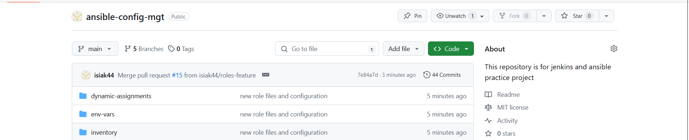

# **Ansible Dynamic Assignments (Include) and Community Roles**

In this project, we will introduce dynamic assignments by using `include` module. As we learnt in the previous project, static assignments use `import` module. The module that enables dynamic is `include`. 

The difference between `static` and `dynamic` is that, when the `import` module is used, all statements are pre-processed at the time playbooks are parsed. That is, when we execute `site.yml` playbook, Ansible will process all the playbooks referenced during the time it is parsing the statements. This also means that during actual execution, if any statement changes, such statement will not be considered. Hence, it is static.

On the other hand, when `include` module is used, all statements are processed only during the execution of the playbook. That is, after the statements are parsed, any changes to the statements encountered during execution will be used. 

In most cases, it is highly recommended to use static assignments for playbooks, because it is more reliable. With dynamic ones, it is hard to debug playbook problems due to it's dynamic nature. However, we will be introducing dynamic assignments for environment-specific variables in this project. 

## **Introducing dynamic assignment into our structure**

In our `ansible-config-mgt` repository, we start a new branch `dynamic-assignments`. 

Create a new folder `dynamic-assignments`. inside this folder, we create a new file `env-vars.yml` and then we will instruct `site.yml` to include this playbook later. Now our structure looks like this 

```├── dynamic-assignments
│   └── env-vars.yml
├── inventory
│   └── dev
    └── stage
    └── uat
    └── prod
└── playbooks
    └── site.yml
└── roles (optional folder)
    └──...(optional subfolders & files)
└── static-assignments
    └── common.yml
```


Since we will be using Ansible to configure multiple environments, and each of these environments will have certain unique attributes, such as **servername**, **ip-address** etc, so we will need a way to set values to variables per specific environment. 

For this reason, we will now create a folder to keep each environment's variable file. Therefore, create a new folder `env-vars`, and then for each environment, we create new **YAML** files which we will use to set variables. 

Now our layout should look like this; 

```├── dynamic-assignments
│   └── env-vars.yml
├── env-vars
    └── dev.yml
    └── stage.yml
    └── uat.yml
    └── prod.yml
├── inventory
    └── dev
    └── stage
    └── uat
    └── prod
├── playbooks
    └── site.yml
└── static-assignments
    └── common.yml
    └── webservers.yml
```


Then we paste the instruction below into `env-var.yml`

```---
- name: collate variables from env specific file, if it exists
  hosts: all
  tasks:
    - name: looping through list of available files
      include_vars: "{{ item }}"
      with_first_found:
        - files:
            - dev.yml
            - stage.yml
            - prod.yml
            - uat.yml
          paths:
            - "{{ playbook_dir }}/../env-vars"
      tags:
        - always
```


There are 3 things to notice from the above code; 

1. we used `include_vars` syntax instead of `include` because Ansible developers decided to separate different features of the module. From Ansible version 2.8, the `include` module is deprecated and variants of `include_*` must be used. These are : 

- include_role

- include_tasks

- include_vars

In the same version, variants of **import** were also introduced;

- import_role

- import_tasks


2. We made use of a special variables `{{playbook_dir}}` and `{{inventory_file}}`. 

`{{playbook_dir}}` will help Ansible to determine the location of the running playbook, and then navigate to another path on the filesystem. `{{inventory_file}}` on the other hand will dynamically resolve to the name of the inventory file being used, then append `.yml` so that it picks up the required file within the `env-vars` folder.


3. We are including the variables using a loop. `with_first_found` implies that, while looping through the list of files, the first found is used. This is good so that we can always set default values in case an environment-specific env file does not exist. 

## **Update site.yml with dynamic assignments**

Now we need to update `site.yml` file with the codes below to make use of the dynamic assignment. (_At this point, we cannot test it yet as we are just setting the stage for what is yet to come_)

```---
- hosts: all
- name: Include dynamic variables 
  tasks:
  import_playbook: ../static-assignments/common.yml 
  include: ../dynamic-assignments/env-vars.yml
  tags:
    - always

-  hosts: webservers
- name: Webserver assignment
  import_playbook: ../static-assignments/webservers.yml

```


### *Community Roles*

Now it is time to create a role for MySQL database; it should install MySQL package, create a database and configure users. But instead of re-creating these roles, there are tons of production-ready and dynamic roles developed by other open-source engineers that can accommodate most Linux flavours. With Ansible Galaxy, we can simply download a ready-to-use ansible role to save time. 

### *Download MySQL Ansible Role*

We can browse available community roles [here](https://galaxy.ansible.com/ui/)

In this case, we will be using a MySQL role developed by [gerrlingguy](https://galaxy.ansible.com/ui/standalone/roles/geerlingguy/mysql/)

Now on `Jenkins-Ansible` server, we make sure that git is installed with `git --version`, then we go to `ansible-config-mgt` directory and run the following commands

`git init`

`git pull https://github.com/<your-name>/ansible-config-mgt.git`

`git remote add origin https://github.com/<your-name>/ansible-config-mgt.git`

`git branch roles-feature`

`git switch roles-feature`


Inside `roles` directory, we create a new role with `ansible-galaxy install geerlingguy.mysql` and rename the folder to MySQL

`mv geerlingguy.mysql/ mysql`


Then we read `README.md` file and edit the roles configuration to use the correct credentials for MySQL, required for the **tooling** website. 

Now we upload the changes to GitHub. 

```
git add .
git commit -m "Commit new role files into GitHub"
git push --set-upstream origin roles-feature
```




Now we create a pull request and merge it to `main` branch on Github.

### *Load Balancer Roles*

Here we want to be able to choose which load balancer to use between `Nginx` and `Apache`, so we create two roles respectively.

1. Nginx

2. Apache

Therefore, 

- we can decide to develop our roles or find available ones from Ansible Galaxy community. In this case, we used ansible-galaxy module to import Nginx and Apache roles from 'geerlingguy' as we did with MySQL role. 


- Then update both `static-assignment` and `site.yml` files to refer to the roles. 

*Important Hints:*

Since we cannot use both Nginx and Apache load balancer, we need to add a condition to enable either one - this is where we can make use of variables. 

- We declare a variable in `defaults/main.yml` file inside the Nginx and Apache roles. Name each variables `enable_nginx_lb` and `enable_apache_lb` respectively. 

- Set both values to false

- Then we declare another variable in both roles `load_balancer_is_required` and set its value to `false`


- Update static-assignment and site.yml files respectively


Inside the `loadbalancers.yml file` we paste the below code

```
- hosts: lb
  roles:
    - { role: nginx, when: enable_nginx_lb and load_balancer_is_required }
    - { role: apache, when: enable_apache_lb and load_balancer_is_required }

```


Inside the `db.yml file` we paste the below code

```
---
- hosts: db
  become: yes
  roles:
  - mysql
  
  ```


`site.yml` file includes;

```
- hosts: uat-webservers
- import_playbook: ../static-assignments/uat-webservers.yml

- hosts: db
- import_playbook: ../static-assignments/db.yml

- hosts: lb
- name: Loadbalancers assignment
  import_playbook: ../static-assignments/loadbalancer.yaml
  when: load_balancer_is_required 

```


Now we can make use of `env-vars/uat.yml` file to define which load balancer to use in UAT environment by setting respective environment variable to true. 

Here we activate load balancer and enable nginx by setting these in the respective environment's env-vars file. 

```
enable_nginx_lb: true
load_balancer_is_required: true

```


The same setup must work with `Apache` LB, so we can switch it by setting respective environmental variable to true and other to false. 

To test this, we need to update the inventory for each environment and run Ansible against each environment. 


