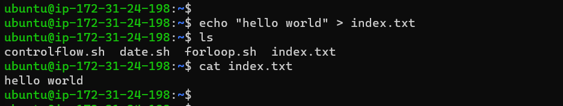

# Shell Scripting Hands-on Project

## Shell Scripting Syntax Element

### 1. Variables: 

Variables can store data of various types such as numbers, strings and arrays. We can assign values to variables with the `=` operator and access thier values using variable name preceded by a `$` sign. 

`name="John"`

> Here we assign value "john" to variable "name"

`echo $name`

echo simply retrieves our value which is stored in variable. 

### 2. Control Flow:

Bash provides control flow statement like `if-else`, `for loops`, `while loops`, and `case` statement to control the flow of execution in your scripts. These statements allows you to make decisions, iterate over lists and execute  different commands based on conditions. 

> Using if-else to execute script based on a conditions

`#!/bin/bash`

`read -p "Enter a number: " num`

`if [ $num -gt 0 ]; then`

`echo "The number is positive."`

`elif [ $num -lt 0 ]; then`

`echo "The number is negative."`

`else`

`echo "The number is zero."`

`fi`

This code will prompt user to type a number and then prints a statement stating the number is positive or negative. 

> Iterating through a list using for loop

`#!/bin/bash`

`for (( i=1; i<=5; i++ ))
do
    echo $i
done`

Example script to print numbers from 1 to 5 using a for loop

### 3. Command substitution:

It allows us to capture the output of a command and use it as a value within our script. We can use the backtick `` or the $() syntax for the command substitution. 

Using backtick for command substitution `current_date=`date +%Y-%m-%d`

Using $() syntax for command substitution `current_date=$(date +%Y-%m-%d)`

### 4. Input and Output:

Bash provides various ways to handle input and output. You can use the `read` command to accept user input. and output text to the console using the `echo` command. Additionally, you can redirect input and output using operators like > (output to a file), < (input from a file) and | (pipe the output of one command as input to another).

`echo "Enter your name:"
`
`read name
`

> This code simply accept user input 

`echo "Hello World"
`

> This command output text "Hello world" to terminal.

`echo "hello world" > index.txt
`
> Output "hello world" into "index.txt"

`grep "pattern" < input.txt
`
> Pass the content of a file as input to a command. 

`echo "hello world" | grep "pattern"
`
> Pass the result of a command as input to another command. 

### 5. Functions

Bash also allows us to define and use funtions to group related commands together. Functions provide a way to modularize code and make it more reusable. we can define function using the function keyword or simply  by declaring the function name followed by parentheses. 

`#!/bin/bash
`

> Define a function to greet the user

`greet() {
    echo "Hello, $1! Nice to meet you."
}
`

> Call the greet function and pass the name as an argument

`greet "John"
`

## First Shell Script 

Created a folder with 

`mkdir shell-scripting`

then we create a file called user-input.sh

`touch user-input.sh`

Then we paste the below code inside `user-input.sh`

`#!/bin/bash
`

specify the type of bash interpreter to be used to execute the script.

Prompts the user for their name

`echo "Enter your name:"
`

`read name
`

Display a greeting with the entered name

`echo "Hello, $name! Nice to meet you."
`

This code block prompt user to enter name. When we input the name, it displays the text Hello! Nice to meet you. 

Next step is to save and make this file excutable with 

`sudo chmod +x user-input.sh`

after that we then run the script with 

`user-input.sh`

## Directory Manipulation and Navigation

This script displays the current directory, create a new directory called "my_directory", it then switch to the newly created directory, create two files inside the folder, list the files, remove the directory and its content and finally list the current directory again. 

`#!/bin/bash
`

> Display current directory

`echo "Current directory: $PWD"
`

> Create a new directory

`echo "Creating a new directory..."
mkdir my_directory
echo "New directory created."
`

> Change to the new directory

`echo "Changing to the new directory..."
cd my_directory
echo "Current directory: $PWD"
`

> Create some files

`echo "Creating files..."
touch file1.txt
touch file2.txt
echo "Files created."
`

> List the files in the current directory

`echo "Files in the current directory:"
ls
`

> Move one level up

`echo "Moving one level up..."
cd ..
echo "Current directory: $PWD"
`

> Remove the new directory and its contents

`echo "Removing the new directory..."
rm -rf my_directory
echo "Directory removed."
`

> List the files in the current directory again

`echo "Files in the current directory:"
ls
`

then we run `sudo chmod +x navigating-linux-filesystem.sh` to set execute permission on the file. 

then we run the script 

## File Operations and Sorting 

This scripts creates three files (file.txt, file2.txt and file3.txt), displays the files in their current order, sort them alphabetically, saves the sorted files in sorted_files.txt, and finally displays the content of the final sorted file. 

First we created a file called sorting.sh using `touch sorting.sh`

then we copy and paste below code inside sorting.sh with `nano sorting.sh`

`#!/bin/bash
`

> Create three files

`echo "Creating files..."
`

`echo "This is file3." > file3.txt
`

`echo "This is file1." > file1.txt
`

`echo "This is file2." > file2.txt
`

`echo "Files created."
`

> Display the files in their current order

`echo "Files in their current order:"
ls

`
>Sort the files alphabetically

`echo "Sorting files alphabetically..."
`

`ls | sort > sorted_files.txt
`

`echo "Files sorted."
`

> Display the sorted files

`echo "Sorted files:"
`

`cat sorted_files.txt
`

> Remove the original files

`echo "Removing original files..."
`

`rm file1.txt file2.txt file3.txt
`

`echo "Original files removed."
`

> Rename the sorted file to a more descriptive name

echo "Renaming sorted file..."

`mv sorted_files.txt sorted_files_sorted_alphabetically.txt
`

`echo "File renamed."
`

> Display the final sorted file

`echo "Final sorted file:"
`

`cat sorted_files_sorted_alphabetically.txt
`

We set execute permission on sorting.sh using `sudo chmod +x sorting.sh` and

run the script

## Working with Numbers and Calculations

This script defines two variables num1 and num2 with numeric values, performs basic arithmetic operations (addition, subtraction, multiplication, division and modules) and displays the results. It also performs more complex calculations such as raising num1 to the power of 2 and calculating the square root of num2, and then displays those results as well. 

First we Create a file called calculations.sh using `touch calculations.sh` and then paste the below code in this file

`#!/bin/bash
`

> Here we define two variables with numeric values

`num1=10
`

`
num2=5
`

> Perform basic arithmetic operations

`sum=$((num1 + num2))
`

`difference=$((num1 - num2))
`

`product=$((num1 * num2))
`

`quotient=$((num1 / num2))
`

`remainder=$((num1 % num2))
`

> Display the results

`echo "Number 1: $num1"
`

`echo "Number 2: $num2"
`

`echo "Sum: $sum"
`

`echo "Difference: $difference"
`

`echo "Product: $product"
`

`echo "Quotient: $quotient"
`

`echo "Remainder: $remainder"
`

> Perform some more complex calculations

`power_of_2=$((num1 ** 2))
`

`square_root=$(awk "BEGIN{ sqrt=$num2; print sqrt }")
`

> Display the results

`echo "Number 1 raised to the power of 2: $power_of_2"
`

`echo "Square root of number 2: $square_root"
`

> Again we set execute permission on the calculations.sh file using `sudo chmod +x calculations.sh`

run the script. 

## File Backup and Timestamping

This script defines the source directory and backup directory paths. It checks if the source directory exist,if yes it exit and if not It then creates a timestamp using the current date and time, and also check if backup directory exist, and then create a backup directory with the timestamp appended to its name. The script then copies all files from the source directory to the backup directory using the cp command with the -r option for recursive copying. Finally, it displays a message indicating the completion of the backup process and shows the path of the backup directory with the timestamp. 

`#!/bin/bash
`

> Here we define the source directory and backup directory which I have created already.

`source_dir="/home/ubuntu/backupfiles/newfile/"
`

`
backup_dir="/home/ubuntu/backupfiles/"
`

> we check if source directory exists

`
if [ ! -d "$source_dir" ]; then
`

`echo "Source directory '$source_dir' does not exist."
`

`exit 1
`

`fi
`

> Create a backup directory with the timestamp

`
timestamp=$(date +"%Y%m%d%H%M%S")
`

`
backup_dir_with_timestamp="$backup_dir/backup_$timestamp"
`

> Check if the backup directory already exists, if it exit then abbort. 

`
if [ -d "$backup_dir_with_timestamp" ]; then
`

`echo "Backup directory '$backup_dir_with_timestamp' already exists. Aborting."
`

`exit 1
`

`fi
`

> Create the backup directory

`mkdir -p "$backup_dir_with_timestamp"
`

> Copy all files from the source directory to the backup directory

`cp -r "$source_dir"/* "$backup_dir_with_timestamp"
`

> Display a message indicating the backup process is complete

`echo "Backup completed. Files copied to: $backup_dir_with_timestamp"
`

