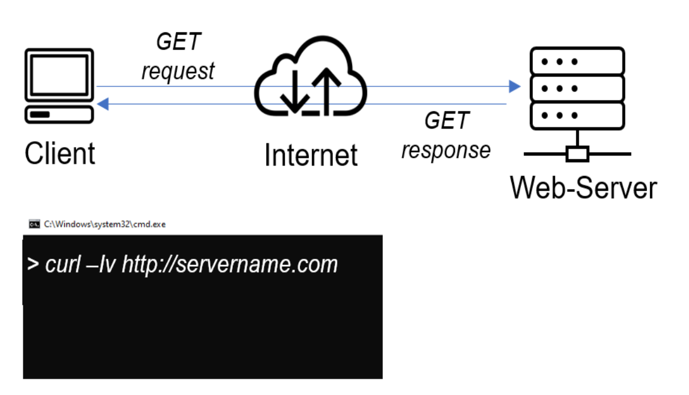
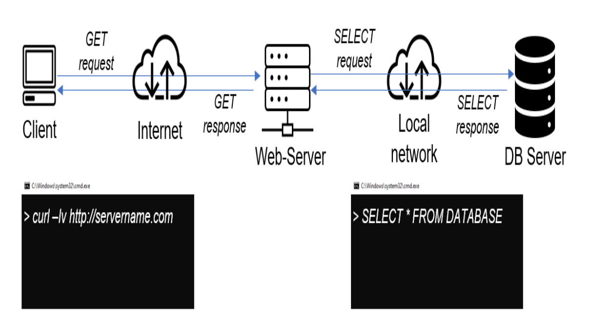
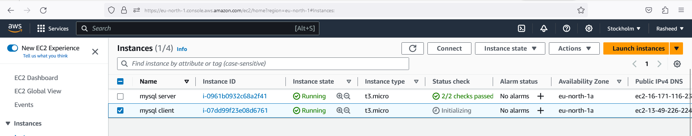
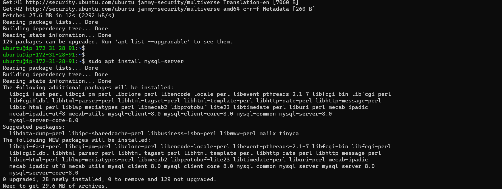
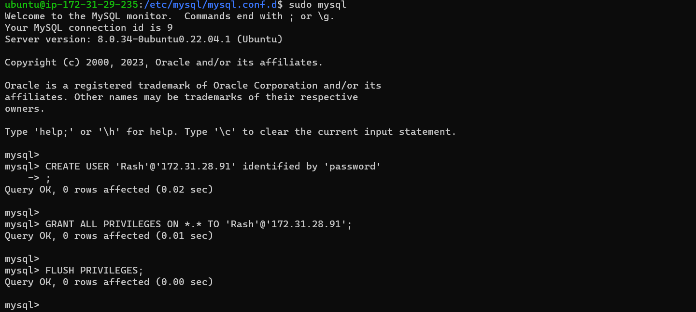
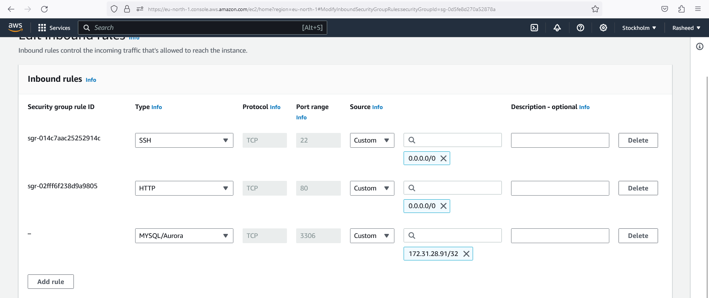
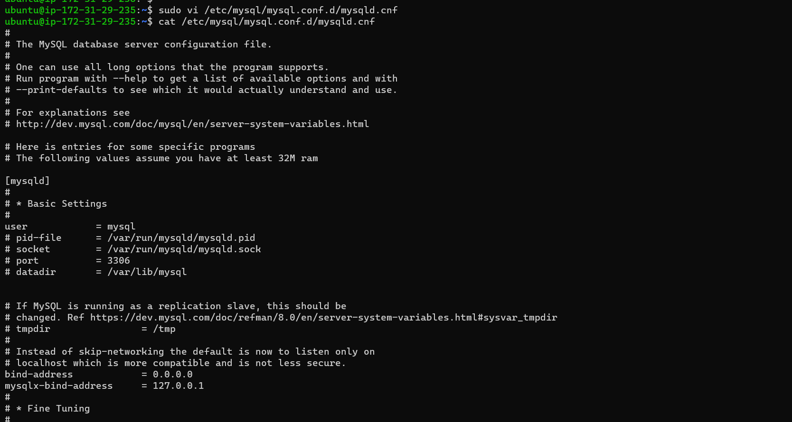
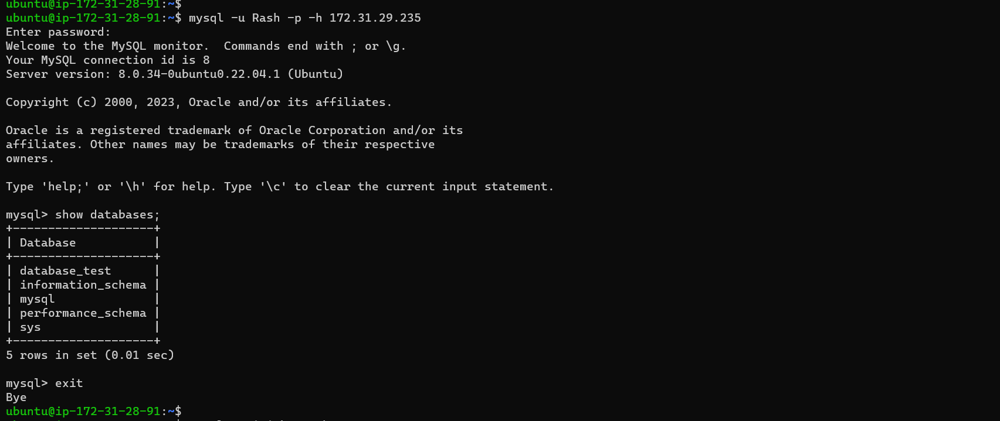

# Client-Server Architecture with MySQL as RDBMS

Client-Server refers to an architecture in whihc two or more computers are connected together over a network to send and receive request between one another. 

In thier communication, each machine has its own role; the machine sending requests is usually referred as "client" while the machine responding is called "server"

And below we have a simple diagram of Web Client-Server architechture

This diagram illustrate a client server trying to access a web site using the curl command by sending HTTP request to a web server (Apache, Nginx, IIS e.t.c) over the internet. 

If we extend this concept further and add a Database Server to our architecture, we get the below picture; 

In further details, the above diagram illustrate a client server that connects and reads/writes to/from a Database server (MySQL, MongoDB, Oracle, SQL server or any other), and the communication between them happens over a local network.

The setup on the diagram abvove is a typical generic Web Stack architecture which has been implemented in previous projects (LAMP, LEMP, MEAN, MERN).

## Implementing a client server arvhitecture using MySQL Database Management System (DBMS)

First we create and configure two linux based virtual server in AWS and name it 

`Server A name - `mysql server`
`

`
Server B name - `mysql client`
`

On MySQL server instance, we install MySQL server software

`sudo apt install mysql-server`

On MySQL client instance, we install MySQL client software

`sudo apt install mysql-client`

Now, we start MySQL console on mysql-server with 

`sudo mysql
`

then we create a user 'Rash' inside Mysql server console with 

`CREATE USER 'Rash'@'172.31.28.91' identified by 'password'
`

Then we grant user Rash full priviledge to mysql-server database. 

`GRANT ALL PRIVILEGES ON *.* TO 'username'@'your_ip' IDENTIFIED BY 'password';
`

After that we then flush privileges so changes can take effect immidiately. 

`FLUSH PRIVILEGES;
`

By default , we have both EC2 virtual server located in the same local virtual network, so they can communicate to each other using local IP addresses. 

Then we use `mysql server's ` private IP address to connect from `mysql client`.

MySQL server uses TCP port 3306 by default, so we will have to configure the inbound rules in `mysql server`` Security groups. 

For extra security, we configure it to allow access only to the specific local IP address of `mysql client`

Next, we need to configure MySQL server to allow connections from remote hosts by replacing `127.0.0.1` to `0.0.0.0` in `/etc/mysql/mysql.conf.d/mysqld.cnf`

`sudo vi /etc/mysql/mysql.conf.d/mysqld.cnf 
`

Once Configuration is done, we then restart mysql with 

`sudo systemctl restart mysql`

From `mysql client` server, we connect remotely to `mysql server` database engine without using SSH. as we must always use mysql utility to perform this action. 

So on MySQL client, we connect to the user 'Rash' in MySQL server with MySQL server private ip address

`mysql -u Rash -p -h 172.31.29.235
`

And finally, we check to see if the client server is successfully connected to the remote MySQL server by showing database.

`Show databases;
`

