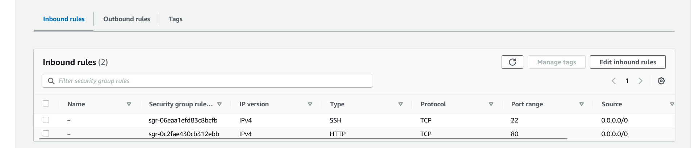

# Implementing Loadbalancer with Nginx

Nginx is a versatile software that performs multiple functions. It can act like a web server, reverse proxy, and a load balancer. However, a load balancer is a component in Nginx that allows us to distribute incoming traffic efficiently across multiple servers or resources to ensure optimal utilization and prevent overload on any single server. 

## Setting up a Basic Load Balancer

To set up the load balancer, we will spin up two EC2 instances running Ubuntu 22.04 and install Apache webserver. we will then open port 8000 to allow traffic from anywhere, and finally update the default page of their webservers to display their public IP address. 

Next, we will spin up another EC2 instance running the same version, and this time install Nginx and configure it to act as a load balancer to help us distribute incoming traffic across the Apache webservers. 

### Step 1: Create two instance 


> Create a new inbound rule to accept traffic from anywhere using port 8000


> Connect to Instance

To connect to the instance, we open our terminal and `cd` into the Download folder where we have the key pair saved. 

and then ssh into our instance

`ssh -i "Rasheed_ec2.pem" ubuntu@ec2-51-20-191-51.eu-north-1.compute.amazonaws.com`


---


### Step 3: Update server and Install Apache Web-Server on both instances. 

`sudo apt update -y &&  sudo apt install apache2 -y
`


Then we verify that Apache is running on both servers. 

`sudo systemctl status apache2
`


---

### Step 4: Configuring Apache to serve a page showing its public IP

By default, Apache serves content on port 80, but in this case, we configured Apache to serve content on port 8000. 

`sudo vi /etc/apache2/ports.conf 
`
The `vi` text editor opens the file `/etc/apache2/ports.conf`

Then we add a new listen directive for port 8000 and save the file. 


Next, we open the file `/etc/apache2/sites-available/000-default.conf` and change port 80 on the "virtualhost" to 8000 as shown below;

`sudo vi /etc/apache2/sites-available/000-default.conf
`


Then we restart Apache to load the new configuration using the command below 

`sudo systemctl restart apache2
`


Now we will create a new index.html file which will contain codes to display our instance public IP, we will then override Apache webserver's default HTML file.

`sudo vi index.html
`

This command opens up a new index file, then we paste the below block code inside the index.html.

```       
 <!DOCTYPE html>
    <html>
    <head>
        <title>My EC2 Instance</title>
    </head>
    <body>
        <h1>Welcome to my EC2 instance</h1>
        <p>Public IP: YOUR_PUBLIC_IP</p>
    </body>
    </html>

```


We change ownership of the index.html file 

`sudo chown www-data:www-data ./index.html
`


Override the Apache default HTML page with our new index.html with the command below; 

`sudo cp -f ./index.html /var/www/html/index.html
`


Then we restart Apache2

`sudo systemctl restart apache2
`


Now we can test on our web browser to see the new index.html page


---


### Step 5: Configuring Nginx as a load Balancer

> First we Provision a new EC2 to lunch our Nginx webserver


Create a new inbound rule for port 80 to accept traffic from anywhere




Then we connect to our instance using SSH

`ssh -i "Rasheed_ec2.pem" ubuntu@ec2-51-20-12-81.eu-north-1.compute.amazonaws.com`


> Update server and install Nginx

`sudo apt update -y && sudo apt install nginx -y
`


Next, we Verify that Nginx is installed

`sudo systemctl status nginx
`


> Configuring Nginx as a loadbalancer

This command creates a new file `loadbalancer.conf` inside `/etc/nginx/conf.d` folder

`sudo vi /etc/nginx/conf.d/loadbalancer.conf
`

Then we paste the below code inside the loadbalancer.conf file

```        
        upstream backend_servers {

            # your are to replace the public IP and Port to that of your webservers
            server 127.0.0.1:8000; # public IP and port for webserser 1
            server 127.0.0.1:8000; # public IP and port for webserver 2

        }

        server {
            listen 80;
            server_name <your load balancer's public IP addres>; # provide your load balancers public IP address

            location / {
                proxy_pass http://backend_servers;
                proxy_set_header Host $host;
                proxy_set_header X-Real-IP $remote_addr;
                proxy_set_header X-Forwarded-For $proxy_add_x_forwarded_for;
            }
        }
    
```


> Now we test our configuration with `sudo nginx -t
`


If there are no errors in the configuration, we then restart Nginx to load the new configuration. 

`sudo systemctl restart nginx
`


Next, we paste the public IP of Nginx load balancer on our web browser and it servers us the 2 Apache web server as shown below; 


This is Apache server 1


This is Apache server 2
