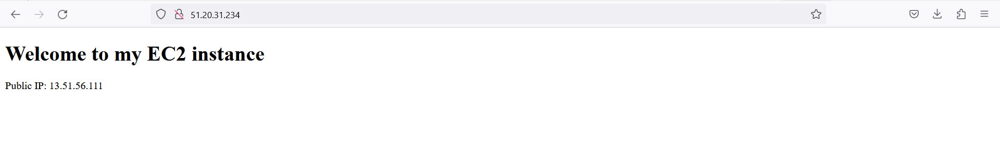
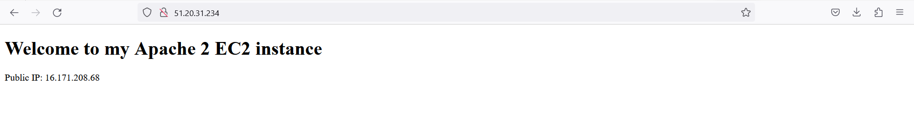

# Automating Loadbalancer configuration with Shell scripting

In this project, we will demonstrates the proccess of automating the setup and configuration of Nginx as a loadbalancer for our Apache webservers. 

## Deploying and Configuring the Apache Web Servers

The Block codes below is a shell script that automates the process of deploying our Apache web servers. 

```
#!/bin/bash

####################################################################################################################
##### This automates the installation and configuring of apache webserver to listen on port 8000
##### Usage: Call the script and pass in the Public_IP of your EC2 instance as the first argument as shown below:
######## ./install_configure_apache.sh 127.0.0.1
####################################################################################################################

set -x # debug mode
set -e # exit the script if there is an error
set -o pipefail # exit the script when there is a pipe failure

PUBLIC_IP=$1

[ -z "${PUBLIC_IP}" ] && echo "Please pass the public IP of your EC2 instance as an argument to the script" && exit 1

sudo apt update -y &&  sudo apt install apache2 -y

sudo systemctl status apache2

if [[ $? -eq 0 ]]; then
    sudo chmod 777 /etc/apache2/ports.conf
    echo "Listen 8000" >> /etc/apache2/ports.conf
    sudo chmod 777 -R /etc/apache2/

    sudo sed -i 's/<VirtualHost \*:80>/<VirtualHost *:8000>/' /etc/apache2/sites-available/000-default.conf

fi
sudo chmod 777 -R /var/www/
echo "<!DOCTYPE html>
        <html>
        <head>
            <title>My EC2 Instance</title>
        </head>
        <body>
            <h1>Welcome to my EC2 instance</h1>
            <p>Public IP: "${PUBLIC_IP}"</p>
        </body>
        </html>" > /var/www/html/index.html

sudo systemctl restart apache2

```

First step is to set up 2 EC2 instance for our apache server. 


we create a new inbound rule to accept traffic from anywhere using port 8000


Next is to connect to the instance on our terminal using SSH 

`ssh -i`


Now we open a new file and paste the above shell script in this file with 

`sudo vi install.sh
`


Then we change the permission on the file to make it executable using the command below;

`sudo chmod +x install.sh
`


Now we can run the shell script to start the automation process with 

`./install.sh PUBLIC_IP of our Apache2 server
`


After that, we check status of Apache

`sudo systemctl status apache2`


Testing Apache on web browser


# Deploying and Configuring Nginx as a Load Balancer

The Block codes below is a shell script that automates the process of deploying and configuring our Nginx web server as a load balancer. 

```

#!/bin/bash

######################################################################################################################
##### This automates the configuration of Nginx to act as a load balancer
##### Usage: The script is called with 3 command line arguments. The public IP of the EC2 instance where Nginx is installed
##### the webserver urls for which the load balancer distributes traffic. An example of how to call the script is shown below:
##### ./configure_nginx_loadbalancer.sh PUBLIC_IP Webserver-1 Webserver-2
#####  ./configure_nginx_loadbalancer.sh 127.0.0.1 192.2.4.6:8000  192.32.5.8:8000
############################################################################################################# 

PUBLIC_IP=$1
firstWebserver=$2
secondWebserver=$3

[ -z "${PUBLIC_IP}" ] && echo "Please pass the Public IP of your EC2 instance as the argument to the script" && exit 1

[ -z "${firstWebserver}" ] && echo "Please pass the Public IP together with its port number in this format: 127.0.0.1:8000 as the second argument to the script" && exit 1

[ -z "${secondWebserver}" ] && echo "Please pass the Public IP together with its port number in this format: 127.0.0.1:8000 as the third argument to the script" && exit 1

set -x # debug mode
set -e # exit the script if there is an error
set -o pipefail # exit the script when there is a pipe failure


sudo apt update -y && sudo apt install nginx -y
sudo systemctl status nginx

if [[ $? -eq 0 ]]; then
    sudo touch /etc/nginx/conf.d/loadbalancer.conf

    sudo chmod 777 /etc/nginx/conf.d/loadbalancer.conf
    sudo chmod 777 -R /etc/nginx/

    
    echo " upstream backend_servers {

            # your are to replace the public IP and Port to that of your webservers
            server  "${firstWebserver}"; # public IP and port for webserser 1
            server "${secondWebserver}"; # public IP and port for webserver 2

            }

           server {
            listen 80;
            server_name "${PUBLIC_IP}";

            location / {
                proxy_pass http://backend_servers;   
            }
    } " > /etc/nginx/conf.d/loadbalancer.conf
fi

sudo nginx -t

sudo systemctl restart nginx
```

First step is to set up an EC2 instance for our Nginx server. 


we created a new inbound rule to accept traffic from anywhere using port 80


Next is to connect to the instance on our terminal using SSH 

`ssh -i`


Now we open a new file and paste the above shell script in this file with 

`sudo vi nginx.sh
`


Then we change the permission on the file to make it executable using the command below;

`sudo chmod +x nginx.sh
`


Now we can run the shell script to start the automation process with 

`./nginx.sh PUBLIC_IP Webserver-1 Webserver-2
`


And finally, we can test Nginx on our web browser




