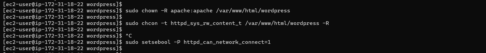

# Implementing WordPress Website with LVM Storage Management. 

This project consists of two parts:

First, we configure a storage subsystem for web and database servers based on the RedHat Linux operating system.

Second part is to install Wordpress and connect it to a remote MySQL database server. 

## STEP1: Implementing LVM on our wordpress web server

First we launched an EC2 instance (Red Hat Linux OS8) and on the EBS console, we created three volumes each of 10GiB


Attached all volumes to the instance


SSH into our terminal to begin configurations and with `lsblk` command we inspect what block devices are attached to the server 


we then use `df -h` command to see all mounts and free space on our server 


Next step is to use `gdisk` utility to create a single partition on each of the disks. 

`sudo gdisk /dev/xvdf
`


Again, we use the `lsblk` command to view the newly configured partition on each disk, as shown below;


Install lVM2 package on our linux server with `sudo yum install lvm2`


`sudo lvmdiskscan` to check for available partitions.


Next step is to use the `pvcreate` utility to initialize each of the 3 disk as physical volumes to be used by LVM. 

```
sudo pvcreate /dev/xvdf1
sudo pvcreate /dev/xvdg1
sudo pvcreate /dev/xvdh1
```

then we verify that the physical volumes has been created successfully with `sudo pvs`


Now we use `vgcreate` utility to add all 3 PVs to a volume group and name it as webdata-vg

`sudo vgcreate webdata-vg /dev/xvdh1 /dev/xvdg1 /dev/xvdf1
`

after that we Verified that VG has been created successfully with `sudo vgs`


And now we use `lvcreate` utility to create 2 logical volumes by using half of the Physical volume size for `apps-lv` and the remaining space of the PV size for `logs-lv`

In this case, the `apps-lv` will be used to store data for the webnsite while the `logs-lv` will be used to store data for logs. 

```
sudo lvcreate -n apps-lv -L 14G webdata-vg
sudo lvcreate -n logs-lv -L 14G webdata-vg
```

Then we verify that our logical volumes has been created successfully by running `sudo lvs`


And to verify the entire setup, we run the below command;

`sudo lsblk 
`


We can use `mkfs.ext4`  to format the logical volumes with the below code

```
sudo mkfs -t ext4 /dev/webdata-vg/apps-lv
sudo mkfs -t ext4 /dev/webdata-vg/logs-lv
```


Furthermore, we create `/var/www/html` directory to store website files. Also, we create `/home/recovery/logs` directory to store backup of log data

`sudo mkdir -p /var/www/html`

`sudo mkdir -p /home/recovery/logs`


Then we mount `/var/www/html` on `apps-lv` logical volume. 

`sudo mount /dev/webdata-vg/apps-lv /var/www/html/
`


And before we mount `/var/log` we have to backup all the files in this directory to `/home/recovery/logs` using the `rsync` utility. This is because all the existing data on `/var/log` will be deleted.

`sudo rsync -av /var/log/. /home/recovery/logs/
`


Now, we mount `/var/log` on `logs-lv` logical volume

`sudo mount /dev/webdata-vg/logs-lv /var/log
`

Then we restore log files from `/home/recovery/log` back into `/var/log` directory. 

`sudo rsync -av /home/recovery/logs/log/. /var/log
`


Next step is to update `/etc/fstab` file so that the mount configuration will persist after restartt of the server. 

The UUID of the device will be used to update the `/etc/fstab` file so we checked for the UUID with `sudo blkid`


And we open the configuration file `/etc/fstab` and update it with our UUID

`sudo vi /etc/fstab`


Then we test the configuration and reload the daemon

```
sudo mount -a
sudo systemctl daemon-reload
```


and finally in this part is to verify all our setup with df -h


### Implementing LVM on our database server

To prepare our database server, we launched a new RedHat EC2 instance and repeated the same step in implementing LVS on web server, in this case, we name our logical volume `db-lv` and mount it to /db. 


SSH into our DB terminal to begin configurations and with `lsblk` command we inspect what block devices are attached to the server


Then we use `gdisk` utility to partition the disk


Installing lvm2 on our db server with `sudo yum -y install lvm2`


Next step is to use the pvcreate utility to initialize the disk as physical volumes to be used by LVM.


Then `sudo vgcreate db-vg /dev/xvdf1` to add our physical volume as a volume group. 


And now we can use lvcreate utility to add our volume group to lvs by running `sudo lvcreate -n db-lv -L 9.99GB db-vg `


here we use `sudo lvs` to see if our logical volume has been created successfully


Inspecting entire setup with lsblk


Now we move on to making /db directory where our lvm will be mounted on and then format our logical volume with ext4 file system.

`sudo mkfs -t ext4 /dev/db-vg/db-lv`


mounting the disk `/dev/db-vg/db-lv` to `/db` directory


Now we update the /etc/fstab file with the lvs file system UUID, this will enable our mount configuration after restarting the server. 

`sudo blkid` provides the UUID of our mounted file


Confirn if configuration is okay with `sudo mount -a` and then reload system with `sudo systemctl daemon reload`


And finally we can confirm our set up with `df -h`


## Step2: Installing Wordpress and Configuring to use MySQL Database


### Install wordpress on our webserver

First we update our system repository 

`sudo yum -y update`


Install wget, apache, and its dependencies

`sudo yum -y install wget httpd php php-mysqlnd php-fpm php-json`


After that, we enable, restart and check Apache status.  

```
sudo systemctl enable httpd
sudo systemctl start httpd
```


To install php and its dependencies, we added the below codes to a file `php.sh` so we can run it as script. 

```
sudo yum -y install https://dl.fedoraproject.org/pub/epel/epel-release-latest-8.noarch.rpm
sudo yum -y install yum-utils http://rpms.remirepo.net/enterprise/remi-release-8.rpm
sudo yum module list php
sudo yum module reset php
sudo yum module enable php:remi-7.4
sudo yum -y install php php-opcache php-gd php-curl php-mysqlnd
sudo systemctl start php-fpm
sudo systemctl enable php-fpm
setsebool -P httpd_execmem 1
```


Restart Apache

`sudo systemctl restart httpd`


The below block codes downloaded the latest version of wordpress into a newly created wordpress file, extracts the file, deletes the tar file, change the sample config file to wp-config,php and finally copy the entire wordpress directory and all its content  to `var/www/html`

```
mkdir wordpress
cd   wordpress
sudo wget http://wordpress.org/latest.tar.gz
sudo tar xzvf latest.tar.gz
sudo rm -rf latest.tar.gz
cp wordpress/wp-config-sample.php wordpress/wp-config.php
cp -R wordpress /var/www/html/

```


Configure SELinux Policies 

```
sudo chown -R apache:apache /var/www/html/wordpress
sudo chcon -t httpd_sys_rw_content_t /var/www/html/wordpress -R
sudo setsebool -P httpd_can_network_connect=1

```



### Installing MySQL on our DB Server EC2

First we update our repository and install mysql-server

```
sudo yum update
sudo yum install mysql-server
```


After successful installation of mysql, we verify  that MySQL is up and running, and if not we restart the service and enable it to run whenever we reboot the system. 

```

sudo systemctl status mysqld
sudo systemctl enable mysqld
sudo systemctl restart mysqld

```


### Configure DB to work with Wordpress

First we create MYSQL inbound rule on DB sever and for extra security we allow traffic from only webserver as show below;


```
sudo mysql
CREATE DATABASE wordpressdb;
CREATE USER `myuser`@`<Web-Server-Private-IP-Address>` IDENTIFIED BY 'mypass';
GRANT ALL ON wordpressdb.* TO 'myuser'@'<Web-Server-Private-IP-Address>';
FLUSH PRIVILEGES;
SHOW DATABASES;
exit

```


### Configuring wordpres to connect to remote database

First we create http inbound rule on our wordpress web sever allowing traffic from anywhere as show below;


Next step is to install mysql on our web server and then test our connection to MySQL DB sever;


Last configuration in this step is to input our database credentials in `/var/www/html/wordpress/wp-config.php`


And finally, we can access webserver public IP on the web browser ;

 


# Implementing WordPress Website with LVM Storage Management. 

This project consists of two parts:

First, we configure a storage subsystem for web and database servers based on the RedHat Linux operating system.

Second part is to install Wordpress and connect it to a remote MySQL database server. 

## STEP1: Implementing LVM on our wordpress web server

First we launched an EC2 instance (Red Hat Linux OS8) and on the EBS console, we created three volumes each of 10GiB


Attached all volumes to the instance


SSH into our terminal to begin configurations and with `lsblk` command we inspect what block devices are attached to the server 


we then use `df -h` command to see all mounts and free space on our server 


Next step is to use `gdisk` utility to create a single partition on each of the disks. 

`sudo gdisk /dev/xvdf
`


Again, we use the `lsblk` command to view the newly configured partition on each disk, as shown below;


Install lVM2 package on our linux server with `sudo yum install lvm2`


`sudo lvmdiskscan` to check for available partitions.


Next step is to use the `pvcreate` utility to initialize each of the 3 disk as physical volumes to be used by LVM. 

```
sudo pvcreate /dev/xvdf1
sudo pvcreate /dev/xvdg1
sudo pvcreate /dev/xvdh1
```

then we verify that the physical volumes has been created successfully with `sudo pvs`


Now we use `vgcreate` utility to add all 3 PVs to a volume group and name it as webdata-vg

`sudo vgcreate webdata-vg /dev/xvdh1 /dev/xvdg1 /dev/xvdf1
`

after that we Verified that VG has been created successfully with `sudo vgs`


And now we use `lvcreate` utility to create 2 logical volumes by using half of the Physical volume size for `apps-lv` and the remaining space of the PV size for `logs-lv`

In this case, the `apps-lv` will be used to store data for the webnsite while the `logs-lv` will be used to store data for logs. 

```
sudo lvcreate -n apps-lv -L 14G webdata-vg
sudo lvcreate -n logs-lv -L 14G webdata-vg
```

Then we verify that our logical volumes has been created successfully by running `sudo lvs`


And to verify the entire setup, we run the below command;

`sudo lsblk 
`


We can use `mkfs.ext4`  to format the logical volumes with the below code

```
sudo mkfs -t ext4 /dev/webdata-vg/apps-lv
sudo mkfs -t ext4 /dev/webdata-vg/logs-lv
```


Furthermore, we create `/var/www/html` directory to store website files. Also, we create `/home/recovery/logs` directory to store backup of log data

`sudo mkdir -p /var/www/html`

`sudo mkdir -p /home/recovery/logs`


Then we mount `/var/www/html` on `apps-lv` logical volume. 

`sudo mount /dev/webdata-vg/apps-lv /var/www/html/
`


And before we mount `/var/log` we have to backup all the files in this directory to `/home/recovery/logs` using the `rsync` utility. This is because all the existing data on `/var/log` will be deleted.

`sudo rsync -av /var/log/. /home/recovery/logs/
`


Now, we mount `/var/log` on `logs-lv` logical volume

`sudo mount /dev/webdata-vg/logs-lv /var/log
`

Then we restore log files from `/home/recovery/log` back into `/var/log` directory. 

`sudo rsync -av /home/recovery/logs/log/. /var/log
`


Next step is to update `/etc/fstab` file so that the mount configuration will persist after restartt of the server. 

The UUID of the device will be used to update the `/etc/fstab` file so we checked for the UUID with `sudo blkid`


And we open the configuration file `/etc/fstab` and update it with our UUID

`sudo vi /etc/fstab`


Then we test the configuration and reload the daemon

```
sudo mount -a
sudo systemctl daemon-reload
```


and finally in this part is to verify all our setup with df -h


### Implementing LVM on our database server

To prepare our database server, we launched a new RedHat EC2 instance and repeated the same step in implementing LVS on web server, in this case, we name our logical volume `db-lv` and mount it to /db. 


SSH into our DB terminal to begin configurations and with `lsblk` command we inspect what block devices are attached to the server


Then we use `gdisk` utility to partition the disk


Installing lvm2 on our db server with `sudo yum -y install lvm2`


Next step is to use the pvcreate utility to initialize the disk as physical volumes to be used by LVM.


Then `sudo vgcreate db-vg /dev/xvdf1` to add our physical volume as a volume group. 


And now we can use lvcreate utility to add our volume group to lvs by running `sudo lvcreate -n db-lv -L 9.99GB db-vg `


here we use `sudo lvs` to see if our logical volume has been created successfully


Inspecting entire setup with lsblk


Now we move on to making /db directory where our lvm will be mounted on and then format our logical volume with ext4 file system.

`sudo mkfs -t ext4 /dev/db-vg/db-lv`


mounting the disk `/dev/db-vg/db-lv` to `/db` directory


Now we update the /etc/fstab file with the lvs file system UUID, this will enable our mount configuration after restarting the server. 

`sudo blkid` provides the UUID of our mounted file


Confirn if configuration is okay with `sudo mount -a` and then reload system with `sudo systemctl daemon reload`


And finally we can confirm our set up with `df -h`


## Step2: Installing Wordpress and Configuring to use MySQL Database


### Install wordpress on our webserver

First we update our system repository 

`sudo yum -y update`


Install wget, apache, and its dependencies

`sudo yum -y install wget httpd php php-mysqlnd php-fpm php-json`


After that, we enable, restart and check Apache status.  

```
sudo systemctl enable httpd
sudo systemctl start httpd
```


To install php and its dependencies, we added the below codes to a file `php.sh` so we can run it as script. 

```
sudo yum -y install https://dl.fedoraproject.org/pub/epel/epel-release-latest-8.noarch.rpm
sudo yum -y install yum-utils http://rpms.remirepo.net/enterprise/remi-release-8.rpm
sudo yum module list php
sudo yum module reset php
sudo yum module enable php:remi-7.4
sudo yum -y install php php-opcache php-gd php-curl php-mysqlnd
sudo systemctl start php-fpm
sudo systemctl enable php-fpm
setsebool -P httpd_execmem 1
```


Restart Apache

`sudo systemctl restart httpd`


The below block codes downloaded the latest version of wordpress into a newly created wordpress file, extracts the file, deletes the tar file, change the sample config file to wp-config,php and finally copy the entire wordpress directory and all its content  to `var/www/html`

```
mkdir wordpress
cd   wordpress
sudo wget http://wordpress.org/latest.tar.gz
sudo tar xzvf latest.tar.gz
sudo rm -rf latest.tar.gz
cp wordpress/wp-config-sample.php wordpress/wp-config.php
cp -R wordpress /var/www/html/

```


Configure SELinux Policies 

```
sudo chown -R apache:apache /var/www/html/wordpress
sudo chcon -t httpd_sys_rw_content_t /var/www/html/wordpress -R
sudo setsebool -P httpd_can_network_connect=1

```


### Installing MySQL on our DB Server EC2

First we update our repository and install mysql-server

```
sudo yum update
sudo yum install mysql-server
```


After successful installation of mysql, we verify  that MySQL is up and running, and if not we restart the service and enable it to run whenever we reboot the system. 

```

sudo systemctl status mysqld
sudo systemctl enable mysqld
sudo systemctl restart mysqld

```


### Configure DB to work with Wordpress

First we create MYSQL inbound rule on DB sever and for extra security we allow traffic from only webserver as show below;


```
sudo mysql
CREATE DATABASE wordpressdb;
CREATE USER `myuser`@`<Web-Server-Private-IP-Address>` IDENTIFIED BY 'mypass';
GRANT ALL ON wordpressdb.* TO 'myuser'@'<Web-Server-Private-IP-Address>';
FLUSH PRIVILEGES;
SHOW DATABASES;
exit

```


### Configuring wordpres to connect to remote database

First we create http inbound rule on our wordpress web sever allowing traffic from anywhere as show below;


Next step is to install mysql on our web server and then test our connection to MySQL DB sever;


Last configuration in this step is to input our database credentials in `/var/www/html/wordpress/wp-config.php`


And finally, we can access webserver public IP on the web browser ;

 


